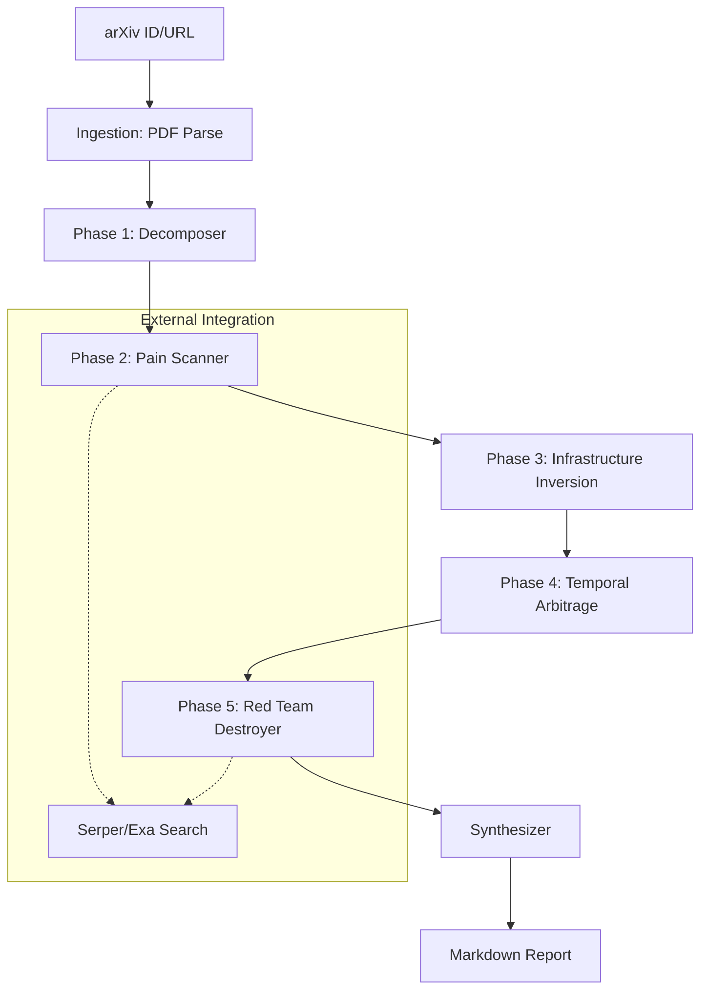

# Pipeline Architecture

The core of `arxiv2product` is a 5-phase multi-agent pipeline implemented in `pipeline.py`. Each phase uses a specialized agent with a specific premise (defined in `prompts.py`).

## The 5 Phases (Adversarial Pipeline)

1.  **Phase 1: Decomposer (The Architect)**
    - **Goal**: Break down the paper into atomic technical primitives.
    - **Process**: Analyzes the research paper's methodology and technical innovations. It ignores high-level fluff and extracts the underlying "building blocks" (e.g., specific algorithms, novel data structures, unique optimization techniques).

2.  **Phase 2: Pain Scanner (The Market Researcher)**
    - **Goal**: Map primitives to real-world market pain.
    - **Process**: Takes the technical primitives and performs live web research (via Serper/Exa) to find industries or niches experiencing problems that these primitives can solve.

3.  **Phase 3: Infrastructure Inversion (The Systems Thinker)**
    - **Goal**: Identify second-order problems.
    - **Process**: "If everyone adopts this technology, what new problems does *that* create?" It looks for infrastructure gaps, tooling needs, and integration challenges that arise as a byproduct of the technical innovation's success.

4.  **Phase 4: Temporal Arbitrage (The Opportunist)**
    - **Goal**: Identify time-limited build opportunities.
    - **Process**: Looks for "windows of opportunity" where current tech, regulations, or market trends align with the research. It answers: "Why is *now* the time to build this?"

5.  **Phase 5: Red Team Destroyer (The Auditor)**
    - **Goal**: Brutally attack every idea.
    - **Process**: An adversarial agent that tries to find every reason why the proposed product ideas will fail. It looks for technical feasibility issues, strong existing competitors, or fatal market flaws. Only the ideas that survive this phase make it into the final report.

## Synthesis & Reporting

- **Synthesizer Agent**: Takes the survived ideas and crafts them into a structured Markdown report.
- **Reporting Module**: Handles the final formatting and ensures the output is professional and actionable.

## Orchestration Flow

